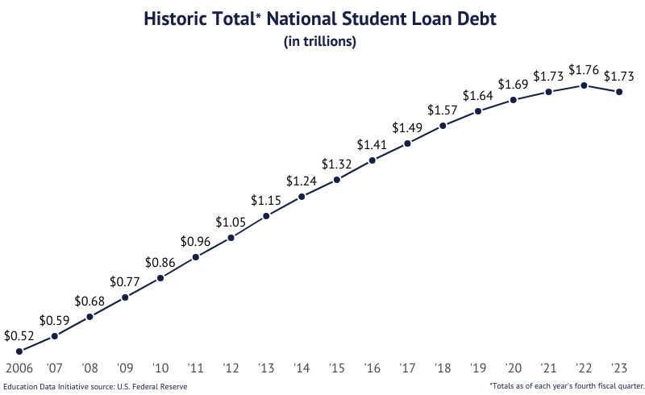

# What Are We Exploring?

This project examines claims made by presidential candidates about factors that impact Americans' daily lives. The goal of this project is to provide voters with a clear, data-driven understanding of key political issues: student loan debt, economic health, immigration, and crime. Through narrative visualizations, we aim to help voters make informed decisions based on facts and trends, rather than rhetoric alone.

# Topics

1. Student Loans
2. Economy
3. Immigration & Crime

# Student Loans

## What Are Student Loans?

Student loans are financial tools that help individuals cover the cost of higher education, including tuition, housing, and other expenses. Federal loans, provided by the government, are among the most common, with varying types for undergraduate and graduate students.

## Why Are Student Loans Important?

In the United States, student loan debt exceeds $1.7 trillion, affecting nearly 45 million Americans. Student debt can impact quality of life, delay home ownership, and even affect career choices. This issue has been central to recent presidential debates, with candidates proposing different solutions, including loan forgiveness and income-driven repayment plans. Understanding the nuances of student loans—who carries this debt, how it’s distributed across demographics, and how it impacts economic choices—is essential to informed voting on related policy proposals.

## How Do Student Loans Affect Americans?

This section will visualize data on student loans by age, education level, institution type, and major. We’ll look at:

- **Loan Type**: Federal undergraduate vs. graduate loans.
- **Age & Marital Status**: How debt varies by age and marital status.
- **Institution Type**: Comparing debt across public, private nonprofit, and for-profit institutions.
- **Major**: Which fields of study correlate with higher debt levels, reflecting varying educational costs and potential income after graduation.

## Terminology to Know

- **Federal Undergraduate Loans**: Loans issued by the federal government for undergraduate students, often with lower interest rates and varying repayment options.
- **Federal Graduate Loans**: Loans available for graduate students, often at higher interest rates.
- **Loan Forgiveness**: Programs or policies that relieve borrowers from repaying part or all of their federal loans.
- **Income-Driven Repayment (IDR)**: A repayment plan that bases monthly payments on the borrower’s income and family size, intended to make repayment more manageable for low-income earners.

## Student Loan Trend

The report from [Education Data Initiative](https://educationdata.org/student-loan-debt-statistics) shows that the student loan debt in the US sums **$1.753 trillion**. The line chart below highlights the significant increase on students and graduates. The steep growth in national student loan debt in the US underscores the urgency for policies to address student loan debt sustainability for future generations.

Harris/Biden Administration claims, "We have reduced the burden of student loans through forgiveness programs, repayment pauses, and limiting interest accumulation." On the other hand, Trump remakrs, "Our administration focused on minimizing federal overreach, promoting private-sector alternatives, and limiting unncessary loan expansions." Under Biden's presidency, his initiatives such as cancellation of up to $20,000 in student loans and repayment pause extensions contributed to decreasing the increasing trend of federal loans in the US by bringing the national loan amount by $0.03 trillion.

## Student Loan by Category

The bar graph below unpacks the complexities of student loan debt through three major lenses: **Institution Type and Major**, **Racial and Gender Disparities**, and **Personal Circumstances**, offering crucial insights that can shape your understanding of education policy debates.

Diving deeper into each claim made by each candidate, it's clear that Harris promotes the Biden administration's forgiveness programs and expanding income-driven repayment (IDR) plans like SAVE, capping payments to reduce monthly burdens. On the other hand, Trump administration will work on streamlining loan programs by consolidating federal repayment plans into fewer, simpler options. Furthermore, Trump expressed to reduce the government's role in student lending, encouraging private-sector competition, bettering student loan rates, etc.

Harris administration is most likely to target black and hispanic borrowers, those unmarried with dependents, for-profit borrowers and those in healthcare fields. In contrary, Trump will likely aim for 30/older individuals, those who are in/went to private nonprofits, engineering & copmuter science students and male borrowers. In the following two, we study how each group of people in each category are affected by student loan debt.

<iframe src="https://public.tableau.com/views/midwaycheckpoint/Dashboard1?:showVizHome=no&:embed=true" width="1200" height="800" ></iframe>

<iframe src="https://public.tableau.com/views/midwaycheckpoint/Dashboard2?:showVizHome=no&:embed=true" width="1000" height="800"></iframe>

Key takeaways:

- Harris adminstration focuses on forgiving significant amounts for borrowers, especially those marginalized or pursuing advanced degrees. Furthermore, forgiveness programs will target high-debt sectors or racial inequities. To keep in mind is that forgiveness efforts largely focus on smaller groups with graduate loans.
- The main emphasis of Trump administration would be to reduce borrowing for graduate students. The streamlining repayment or partnering with private lenders will help older borrowers and private nonprofit students. A warning may be that graduate students at for-profits or in healthcare bear high debt burdens but are less likely to benefit from a repayment strategy that doesn't include targeted relief.

## How would student loan forgiveness impact the average borrower?

Let us start by examining the average amount owed per borrower. This value was calculated by dividing the total amount of federal
student loans divided by the number of unique borrowers. This value has steadily grown every year at roughly the same amount. Only
recently, under the Biden administration have we seen dips in the amount owed.

We read through both campaign websites to get a better understanding of the exact claims made by candidates regarding student loan forgiveness.
The Harris/Walz campaign is for student loan forgiveness, but the Trump/Vance ticket does not make specific claims either for or against.
However on the campaign trail, former president Trump has argued against student loan forgiveness.

In this hypothetical example, we consider what would happen if student loan forgiveness became policy.
The average monthly payment for a federal student loan with a 10-year term at a 6.8% apr of 38000 is 430$. Again, this 38000$
figure comes from dividing the total outstanding amount by the number of unqiue borrowers.
If the debt was cancelled and the borrower put this into a stock market index fund tracking the popular S&P500 ETF
(like SPY), they would end up with 75,000$

Considering the average home price is 400,000$, with a little more saving, that could be a downpayment on a house!

# Economy

The U.S. economy, the world’s largest as measured by GDP, remains a focal point of intense political debate, with candidates frequently making claims about their 
economic policies' impacts. Both major parties assert that their leadership is better suited to improve the livelihoods of everyday Americans. While the president does 
not have direct control over the economy, they play a critical role in shaping the national economic agenda and tone. To evaluate these assertions, let’s consider some 
of the specific claims made by the candidates and analyze their validity.

President Joe Biden has frequently articulated his economic philosophy as "growing the economy from the middle out and the bottom up, not the top down," arguing that 
his policies have directly benefited the average American. Former President Donald Trump has countered with claims such as, “We have set economic growth records, the 
likes of which we have never seen before,” often pointing to pre-pandemic economic indicators during his tenure.

This section examines these claims by analyzing key economic indicators, such as median household income and job growth, to determine which policies may 
have had a better impact on the American economy.

## What is the economy?

Before diving into the claims, it's important to define the term “economy” and select the metrics used to evaluate it. Common indicators include GDP, GDP growth, median 
wages, inflation, unemployment, job creation, and the S&P 500. Each metric has its strengths and limitations. For this analysis, we focus on median household income and 
non-farm job growth as they provide direct insights into the financial well-being of average Americans.

The analysis begins with a famous question from Ronald Reagan during the 1980 presidential debate:

*"Are you better off today than you were four years ago?"*

By examining trends in these metrics, we aim to assess the validity of economic claims made by Biden and Trump.

## Median Household Income

To evaluate claims about improving the average American’s financial standing, we examined median household income using data from the U.S. Census Bureau.

Median household income rose approximately 24% during the Obama/Biden administration, reflecting steady recovery from the Great Recession. During Trump’s presidency, 
incomes increased by 12% in the first two years before the COVID-19 pandemic disrupted the economy. It’s worth noting that Trump inherited a strong economic foundation 
with historically low unemployment and high GDP growth, bolstered further by the 2017 tax cuts. These cuts likely contributed to short-term increases in income, 
aligning with Trump’s claim of record growth before the pandemic.

While both administrations oversaw income growth, these numbers alone don’t capture the broader economic landscape. Biden inherited an economy ravaged by the pandemic 
but presided over policies aimed at recovery, such as stimulus packages and investments in infrastructure. These actions reflect his stated philosophy of prioritizing 
middle- and lower-income Americans.

## Job growth (Non-Farm)

Job creation is another critical measure of economic performance. Using data from the Bureau of Labor Statistics (BLS), we compared job growth trends across 
administrations.

We managed to gather data from the Bureau of Labor Statistics (BLS) and mapped the job growth/losses and color coded the years
with the color of the party that controlled the presidency. Right off the bat, an interesting trend is visible.
Republican presidents frequently leave office with some kind of economic crisis (We are not stating that they are responsible).

From 1980 onward, job growth trends across presidential terms reveal notable differences in economic performance,
particularly under the Biden/Harris and Trump/Pence administrations. Excluding the anomalous years of 2020 and 2021 due
to the COVID-19 pandemic, Biden/Harris have overseen a robust rebound in non-farm job growth, averaging approximately
4.5 million jobs added annually during their first two years in office. This is a stark contrast to Trump/Pence’s term,
which, pre-pandemic, averaged about 2.3 million jobs per year between 2017 and 2019. While Trump’s early years
reflected consistent job creation, Biden’s administration stands out for its rapid recovery and significant gains
as the economy bounced back from the pandemic-induced downturn.

Again, it is important to remember that Trump inherited low unemployment from Obama (which does also make it harder
to show strong job creation), but also averaged fewer jobs created than his predecessor and successor.

# Immigration and Crime

Immigration and crime were very hot and closely related topics from the previous election. While both candidates made claims regarding immigration and crime issues, Trump heavily focused on them throughout his campaign. In the following few subsections we aim to disseminate some of the claims made by both candidates on those two topics, with the goal of examining their validity through visualization.

## Flow of Undocumented Immigrants Into the US
Many Americans worry about the arrival of undocumented immigrants into the US, and the potential effect they think they may have on society. This is very well known to both candidates, and therefore they both tride to garner votes by making claims on this issue. On one side, Harris claimed that the Biden administration "halved the flow of immigrants" into the country. This was contradicted by Trump, however, who claimed that the Biden administration "spent millions" to bring millions of undocumented immigrants into the country. He further claimed that the day he left office experienced the "lowest illegal immigration in US history". We attempt to evaluate the validity of these claims via the following stacked line graph.

The line graph shows estimates of the amount of undocumented immigrants entering the US per year from 2006 through 2022 (except for 2021). The data is divided by state to show the top 10 states in terms of number of undocumented immigrants enter per year, and the rest of the states are lumped under "other". The bar at the top of the plot reflects the party in control for each year, as well as the name of the president. The data used to is obtained from the Office of Homeland Security and Statistics (OHSS). The graph demonstrates the following key takeaways:
- The lowest number of undocumented immigrants entering the country since 2006 indeed did occur towards the end of Trump's presidency. While this confirms Trump's claim, it is missing context. This is because this point occured in 2020, where COVID had a massive impact on travel and immigration in general.
- The number of undocumented immigrants entering the country experienced a steady decline throughout Trump's presidency, the like of which was not seen with any other president from the reported data. This suggests that the trump administration did in fact enact policies that reduced the flow of undocumented immigrants.
- The lack of data makes it difficult to either validate or disprove Harris' claim. However, the number of undocumented immigrants entering the country did experience an increase from 2020 to 2022, possibly suggesting an increasing trend and casting doubt on the claim.
- In general, there have been no sharp peaks or drops in the number of undcoumented immigrants entering the country since 2006.

## Immigrants and Crime
When discussing immigrants, Trump did not stop at talking about his past and future policies. Instead, he elaborated on the effects he believes immigrants have on American society. He claimed that immigrants "poison the blood of our society", referring to them as "animals" and "rough people". He suggested that they commit violent crimes, thereby having a very adverse effect on society. These are very strong claims, which tend to illicit strong emotions of anger and hatred in many people. Therefore, it is crucial to examine their validity. We do so at a very surface level first by examining if the trend in average crime rate per 100k residents over all states and all types of crimes has a relationship with the average immigrant rate per 1M residents over all states and all documented immigrant statuses. This is depicted in the line graph shown next.

While correlation does not mean causation, we observe from the graph that there isn't even a correlation between the two quantities. Perhaps the only similarity is that they both exhibit drops around 2020 and 2021, which was caused by COVID. However, whereas crime rates exhibit a steady decreasing trend, immigration exhibited an increasing trend before COVID. Therefore, if anything the quantities are negatively correlated!

Some may argue that it is not the documented immigrants that are worrying, but rather the undcoumented ones. Indeed, Trump has claimed that Biden's administration has been bringing undcoumented immigrants from "jails" and "mental asylums" from other countries and allowing them to enter the US. These "rough people" then allegedly commit very large amounts of violent crimes. We study this via the two bump charts shown below, which rank all the states based on the rate of violent crime and property crime respectively. The highlighted states are the top 10 states in terms of number of undocumented immigrants. We can observe from the charts that the top 10 states are distributed evenly across the 50 states in terms of crime rankings. Therefore, there is no evidence that relatively large populations of undcoumented immigrants result in higher crime rates. Some may claim that undocumented immigrants need not necessarily stay in the states where they first arrive into the US. Therefore, we attempt to study this issue further in the following plots.

An alternative view we study also utilized bump charts ranking the US states on violent and property crime, respectively. However, the highlighted states are now sanctuary states, which are states where undcouemtned immigrants are granted some level of protection from deportation. The yellow portion encodes the period of time before the state enacted a sanctuary policy, whereas a red color shows that a sanctuary policy was enacted. We observe very clearly that crime ranking did not consistently increase or decrease across states as they implemented a sanctuary policy. This further suggests that undcoumented immigrants do not cause a rise in crime in the areas where they reside. 

## Explore Crime Rate and Immigrant Rate Trends!

In our final visualization, we give the user the ability to explore trends in crime and documented immigrant rates via two choropleth maps utilizing dynamic querying. The top one displays the crime rate in the each state averaged over the selected time period. It also gives the user to filter by type of crime. The bottom one shows the immigrant rate averaged over the selected time period, and gives the user the ability to filter by immigrant status.

<iframe src="https://public.tableau.com/views/crime_immigration_viz_Geo/Geo?:showVizHome=no&:embed=true" width="1000" height="800"></iframe>

# Final Takeaway

While this project might be coming a little too late (since the elections already happened), we hope that it serves as inspiration for individuals to go out and do their own research before casting their votes. Voting is a very big responsibility, and therefore one should not take it lightly or base it solely on claims or anecdotal evidence provided by politicians. Instead, it should be based on sound research and the thorough examination of the facts at hand.

# References

_/Harris vs. Trump on student loans, education: Where they stand - washington post./_ Harris vs. Trump on student loans, education: Where they stand. (n.d.). https://www.washingtonpost.com/politics/interactive/2024/trump-harris-student-loans-education/

_/A NEW WAY FORWARD FOR THE MIDDLE CLASS A Plan to Lower Costs and Create an Opportunity Economy. (n.d.)./_ https://kamalaharris.com/wp-content/uploads/2024/09/Policy_Book_Economic-Opportunity.pdf
